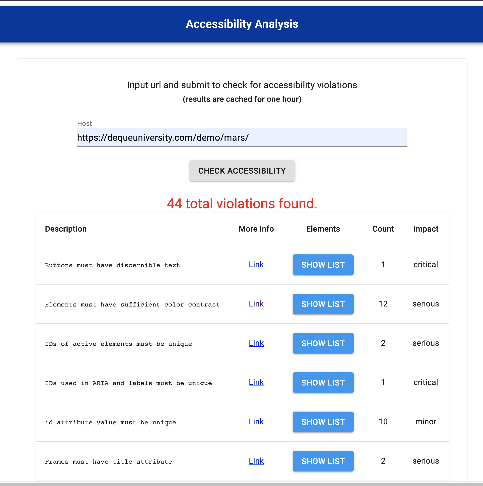

# Accessibiliity Checker
#### A UI taking a url and producing accessibility results
Thanks to Andrew Pulley ([@apulley](https://github.com/apulley)) for the puppeteer / axe integration code
 
### Steps to run locally
1. clone the repo:
1. inside the cloned repo install the server and UI dependencies:
    - `npm run installBoth`
1. build the client (UI) static files:
    - `npm run build`
1. run the application locally:
    - `npm start`
1. visit http://localhost:8080 to see the site running locally

### App Screenshot

